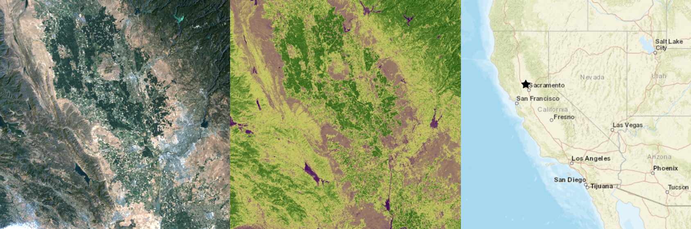
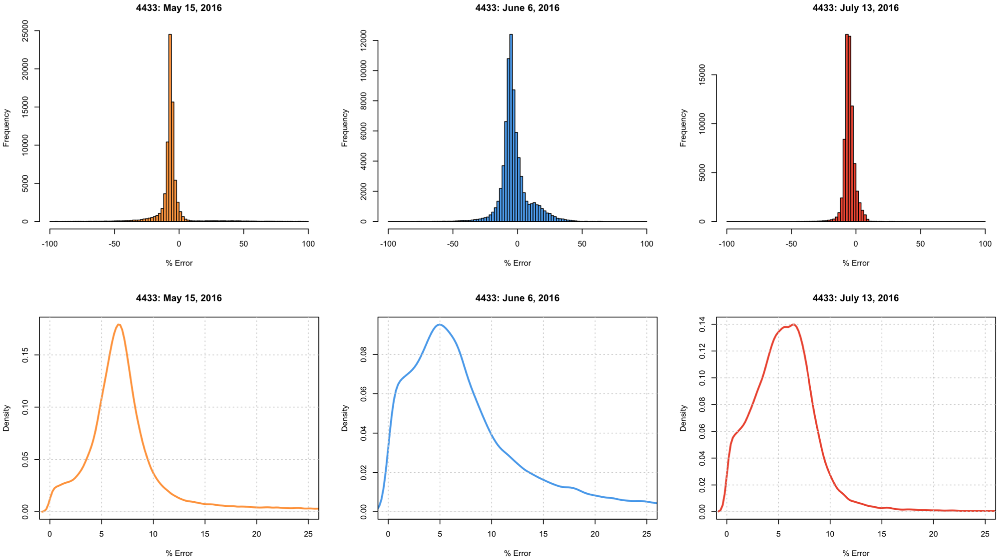

# Tasumi Atmospheric Correction Algorithm
>
> ### Abstract
> The Tasumi algorithm presents a rapid, operational method for estimating at-surface reflectance. This is most applicable for Landsat satellite sensors for cloud-free, low-haze, conditions with sensor view angles less than 20 degrees. This analysis will attempt to quantitative it’s feasibility for deployment in the field for Landsat 5, 7, 8, and in the future Sentinel 2a.
>
>
> ### Dependencies
> This algorithm is written with python 3.71.
> * ee
> * math
> * time
> * progressbar
>
>
> ### Attribute Information:
> The data analyzed here contains the following information is .csv format:
> * fid: field id at given pixel.
> * count: number of occurrences of field with corresponding id.
> * area: area in square meters of field corresponding id.
> * mean: mean value of error at given pixel.
>
> ### Results Preview for Landsat 8
> 
> 
